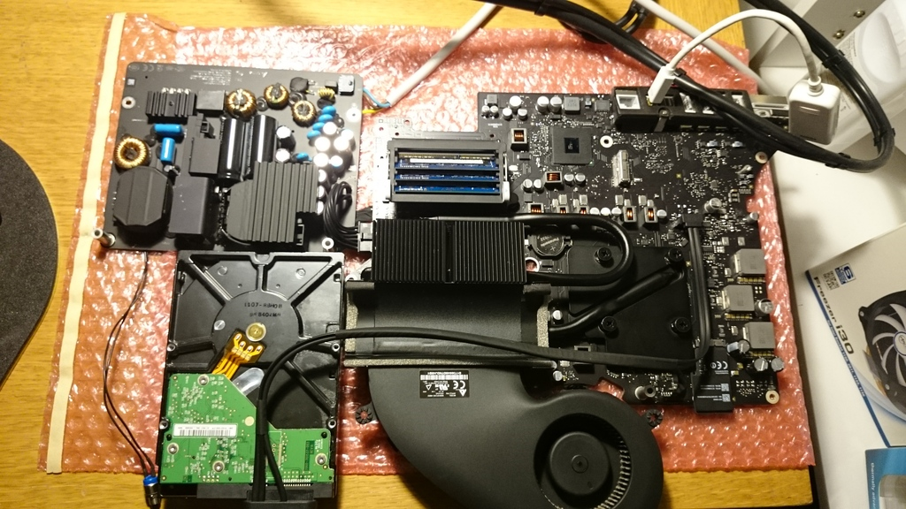

# iMac 改造计划

国外已经有人成功将废旧 iMac 改造成桌面主机，并且通过删除 *.kext 来达到 CPU、显示器完美效果

### 1. 屏幕

* iMac 默认视频信号可以从 Thunderbolt 接口输出[1]
* Thunderbolt 接口与 Mini DisplayPort 接口一致，并向下兼容，Thunderbolt = DP + PCI

* 屏幕选择带 DP 接口的 Dell 24'' 

### 2. 主板

### 3. 外设

### 4. 存储

### 5. 机箱(电源键)

### 6. Kext 文件的修改

### 参考

[1] supermartin, http://www.insanelymac.com/forum/topic/307924-using-a-broken-imacs-hardware-as-a-desktop-computer-kext-help/

