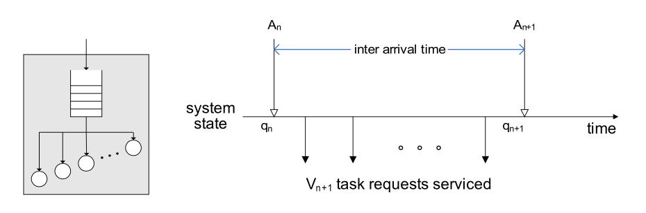

**Performance Analysis of Cloud Computing Centers Using $M/G/m/m+r$**
**Queuing Systems**

IEEE TRANSACTIONS ON PARALLEL AND DISTRIBUTED SYSTEMS

**IEEE Journals & Magazines**

2012

### Abstract

Successful development of cloud computing paradigm necessitates（需要） accurate performance evaluation of cloud data centers. 

As exact modeling of cloud centers is not feasible due to the nature of cloud centers and diversity（多样性） of user requests, we describe a novel approximate analytical model for performance evaluation of cloud server farms and solve it to obtain accurate estimation of the complete probability distribution of the request response time and other important performance indicators. 

The model allows cloud operators to determine the relationship between the number of servers and input buffer size, on one side, and the performance indicators such as mean number of tasks in the system, blocking probability, and probability that a task will obtain immediate service, on the other.

### Index Terms

* Cloud computing
* performance analysis
* response time
* queuing theory
* semi-Markov process
* embedded Markov chain

### 1 INTRODUCTION

1. 云计算科普

2. 问题假设

   * 进入云中心的 task 在**合适**的节点上被服务
   * 服务完成后，task 离开云

3. SLA 和 QoS

   >  SLA（service level agreement）列出了云服务的所有服务用例和云服务提供商与用户之间责任约束，还有对 QoS 的描述
   >
   >  QoS（Quality of Service）包括可用性、吞吐量、可靠性、安全性及其他参数，
   >
   >  还有一些性能参数，比如相应时间、task 阻塞率、立即服务率、和系统平均 task 数量

4. QoS 指标可以使用排队论来解决，云中心与传统的排队系统不同

   * 云中心有大量的节点（成百上千），传统的排队系统很少考虑到这个级别
   * 要使用更普通的而不是更方便概率分布
   * 由于云的特性和用户请求的差异性，云平台必须提供在多负载下的QoS指标

5. 本文目标

### 2 RELATED WORK

### 3 THE PROPOSED ANALYTICAL MODEL

1. 使用 $M/G/m/m+r$ 模型来模拟云工作流程
2. $M/G/m/m+r$ 模型可以看做半马尔可夫过程（马尔可夫过程的到达过程服从指数分布，半马尔科夫可以服从任任意分布）
   * 半马尔可夫过程可以由嵌入式马尔科夫链分析得到
   * 嵌入式马尔可夫链就是时间离散马尔可夫链
   * 选取的马尔可夫观测点是新 task 到达的时间点，观测的数据是系统内 task 数
3. 定义了到达时间间隔、服务时间、余留服务时间、已经服务时间等参数，给出概率分布及概率密度函数，计算拉普拉斯变换结果

#### 3.1 The Embedded Markov Chain

选择马尔可夫观测点，建立离散马尔可夫链

$$
p_{ij}=Prob[q_{n+1} = j|q_{n} = i]
$$

#### 3.2 Departure Probabilities

1. 定义 $\pi_{i}$ 为系统中有 i 个 task 的概率
2. 推导在一个 interval 中一个 task 完成，出系统的概率 $\ P_{x}$
3. 推导在一个 interval 中有机器空转，新到 task 直接执行并完成的概率 $P_{y}$
4. 推导在一个 interval 中，所有机器都忙且队列非空，一个 task 完成后从队列中取出一个 task继续执行，直到队列为空或者 interval 结束（下一个task到来），一共完成 k 个 task 的概率 $P_{z,k}$

#### 3.3 Transition Matrix

1. $i + 1 < j $ 情况下的 $p_{ij}$
2. $i  < m,j \le m $ 情况下的 $p_{ij}$
3. $i,j\ge m $ 情况下的 $p_{ij}$
4. $i \ge m, j<m$ 情况下的 $p_{ij}$

### 4 EQUILIBRIUM BALANCE EQUATIONS

计算稳态概率分布 $\pi_{i}$

#### 4.1 Distribution of the Number of Tasks in the System

1. 计算稳态概率（task到达时系统中有i个task的概率）分布的概率母函数 $PGF \   \Pi(z)$
2. $PGF \   \Pi(z) = PGF \   P(z)$ task 到达时间 task 数分布等于任意时间 task 数分布
3. 概率母函数特征求出 $\bar{p} = P'(1)$
4. Little's Law 求平均响应时间

#### 4.2 Distribution of Waiting and Response Times

1. 等待时间和队列长度同分布
2. 队列长度分布的矩母函数 = 等待时间分布的拉普拉斯转换，得到等待时间分布的拉普拉斯
3. 等待时间分布拉普拉斯 * 服务时间分布拉普拉斯 = 响应时间分布拉普拉斯
4. 计算响应时间概率分布函数 i 阶中心距（原点矩？）
5. 结合之前算出的平均相应时间计算
   * 方差
   * 偏度
   * 峰值

#### 4.3 Probability of Immediate Service

立即服务的概率 = $\pi_{0}+\pi_{1}+\pi_{2}+…+\pi_{m-1}$

#### 4.4 Blocking Probability and Buffer Size

阻塞概率 = $\pi_{m+r}$

### 5 NUMERICAL VALIDATION

1. 进行离散事件模拟
2. 比较模拟数据和分析数据，验证模型的准确性

