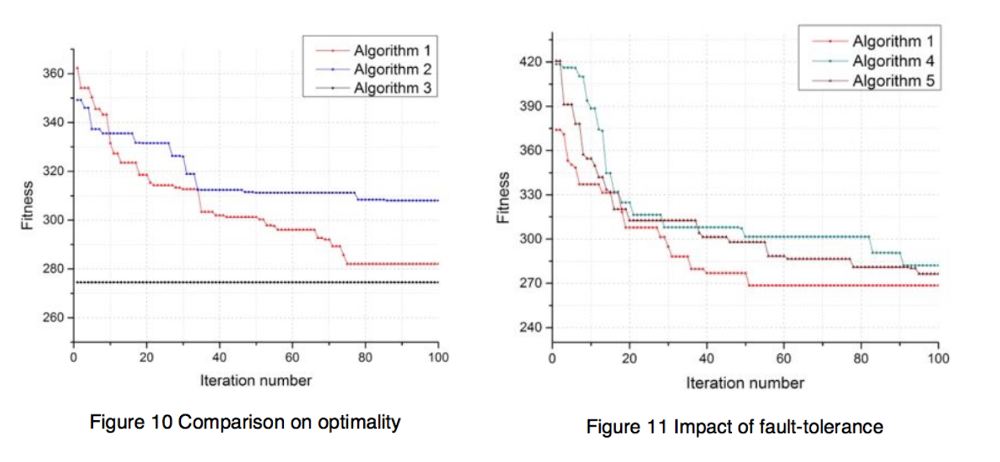
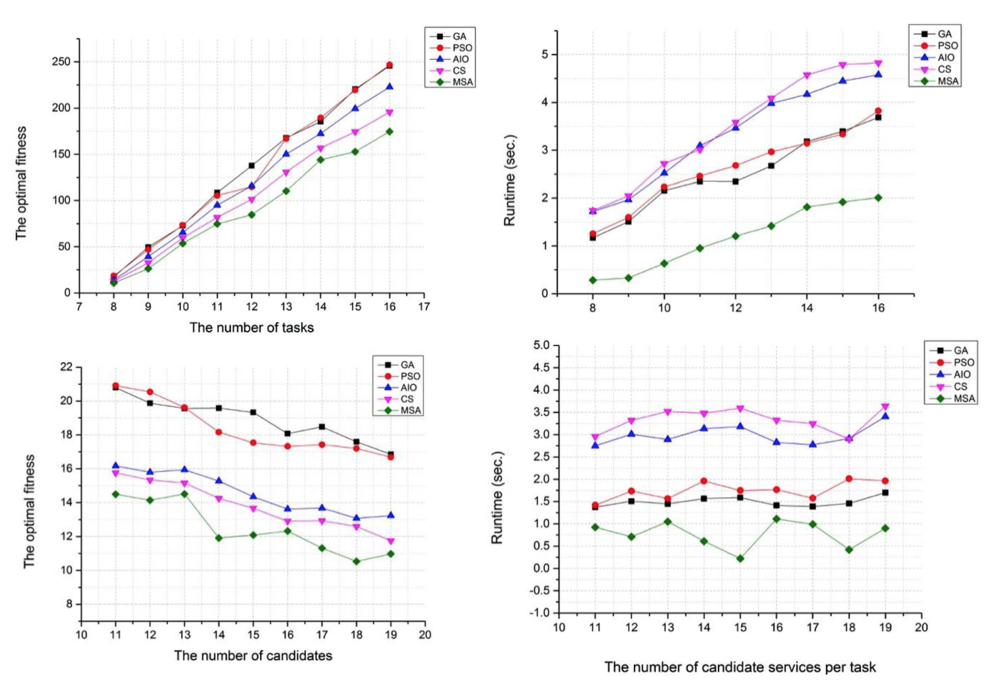

### 1. Parameter Evaluation

Deng 等人在 [1] 中对改进的 GA 进行了参数评估，实验如下：

我们可以对 KH 算法就一下几个参数进行参数评估：

- Nmax
- Dmax
- Omega 
- Iteration number
- Population size

### 2. Optimality Evaluation

Deng 等人在 [1] 中对改进的 GA 算法进行了最优性评估，实验如下：

Deng 等人在 [2] 中对提出的修改过的 SA （MSA）进行了最优性评估，实验如下：

我们可以和 GA、PSO 和暴力破解进行以下对比：

* 最优性（ KH 和 GA、PSO、暴力破解 进行比较）
* 服务组合失败率（ KH with avaQoS model 和 KH、GA、POS、暴力破解 进行比较）

### 3. Scalability Evaluation

Deng 等人在 [1] 中对扩展 GA 进行了扩展性评估（对比实验为暴力破解），实验如下：

Deng 等人在 [3] 中对提出的 TLBO 算法进行了扩展性评估，实验如下：

### Refference

[1] Deng, S., Huang, L., Taheri, J., & Zomaya, A. Y. (2015). Computation offloading for service workflow in mobile cloud computing. *IEEE Transactions on Parallel and Distributed Systems*, *26*(12), 3317–3329.

[2] Deng, S., Huang, L., Li, Y., Zhou, H., Wu, Z., Cao, X., … Li, L. (2016). Toward risk reduction for mobile service composition. *IEEE Transactions on Cybernetics*, *46*(8), 1807–1816.

[3] Deng, S., Huang, L., Hu, D., Zhao, J. L., & Wu, Z. (2016). Mobility-enabled service selection for composite services. *IEEE Transactions on Services Computing*, *9*(3), 394–407.