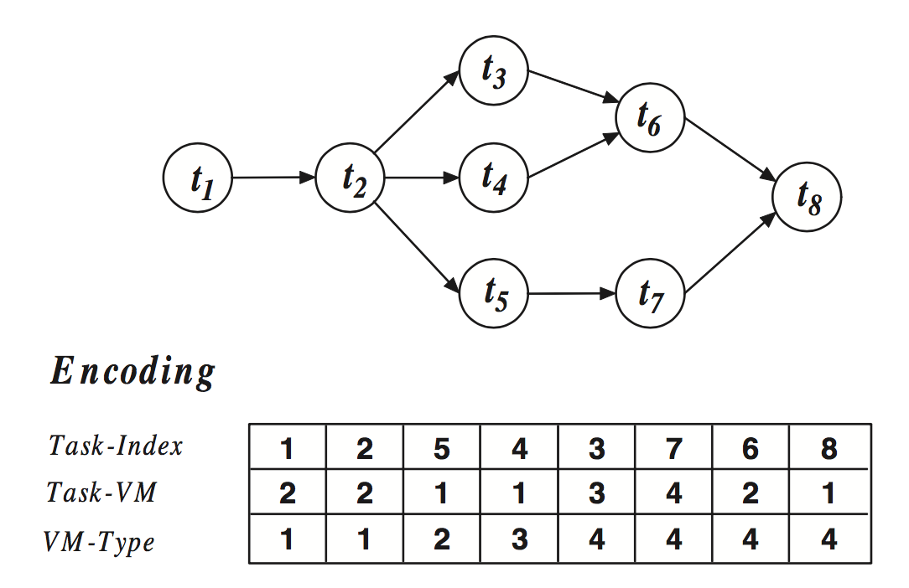
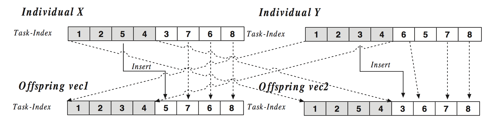
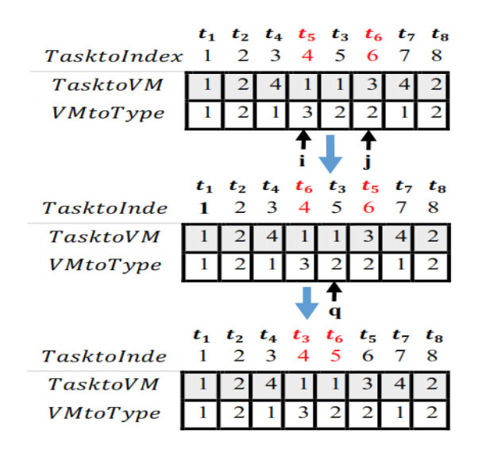

### 5.1 问题描述

高性能和低成本通常是云计划工作流的矛盾目标。 因此，我们提出的工作尝试调和两个冲突的目标，并找到一个可行的计划，以在VM上部署工作流任务，以便在满足SLA约束的情况下最大限度地降低总体成本，从而保证违反给定工作流程的时间更短 比给定的速度。 因此，所产生的问题可以表达为：
$$
Min : \ \ TEC = \sum_{v=1}^{|VM\_POOL|}Price(vm_k) \times(\frac{LST_k - LET_k}{time\ interval}) \\
s.t. : \ \ Prob\{WT>D\}<r
$$
其中 $WT$ 是总的完成时间，$WT = FT_m$，$t_m$ 为整个科学工作流的退出任务，也就是最后一个任务。$D$ 是截止时间，$r$ 是 SLA 协议上签订的截止时间违反率上限。

### 5.2 遗传算法

遗传算法（GA）是一种元启发式，灵感来自属于较大类进化算法的自然选择过程。 遗传算法常用于通过依靠生物启发操作符（如突变，交叉和选择）来生成优化和搜索问题的高质量解决方案。 在遗传算法中，针对优化问题的候选解决方案（称为个人，创意或表型）的群体被演变为更好的解决方案。 每个候选溶液具有一组可以突变和改变的性质（其染色体或基因型）; 传统上，解决方案以二进制表示为0和1的字符串，但是其他编码也是可能的。 基于前面几节提出的问题描述和优化方法，本节介绍了GA的操作定义，包括编码，人口初始化，突变和交叉。

### 5.3 编码

使用遗传算法中的染色体来表示工作流调度问题需要解决三个表述问题：任务映射到下标（Task to Index），任务映射到虚拟机（Task to VM），虚拟机映射到类型（VM to Type）。可以使用一个三元组来表示一个可行的解决方案 $(Task2Index, Task2VM, VM2Type)$，这个三元组中含有长度为 $m$ 三个向量，$m$ 是工作流中任务的数量。

向量 Task2Index 将所有的任务按照其执行的顺序赋予索引值，任务的初始顺序基于工作流本身的依赖约束和拓扑排序，即任务永远不会在其紧邻的前一个执行之前执行，工作流 $W$ 的一个可行的拓扑排序（在[？]中可以找到生成所有可能的拓扑排序的方法）就是一个 Task2Index 向量，如在图9中的工作流中，任务 $t_1 -t_8$ 的一个可行执行顺序为 $\{ 1, 2, 5, 4, 3, 7, 6, 8\}$， 所以可以将其  Task2Index 值设为 $\{ 1, 2, 5, 4, 3, 7, 6, 8\}$。

向量 Task2VM 是任务到虚拟机的映射，图9中的 Task2VM 值代表了任务 $t_1 -t_8$ 分别在 $vm_2$、$vm_2$、$vm_1$、$vm_1$、$vm_3$、$vm_4$、$vm_2$、$vm_1$ 上执行。

向量 VM2Type 是虚拟机到虚拟机类型的映射，图9中的 VM2Type 值代表了虚拟机 $vm_1$、$vm_2$、$vm_3$、$vm_4$ 的类型分别为 $type_1$、$type_1$、$type_2$、$type_3$。

本算法中的染色体编码方式类似于文献 [xx] 中的元启发式算法中的编码方式。

图1还显示了前面给出的样本工作流的编码方案。在这个时间表中，每个任务通过T ask-I ndex向量与[1,2,5,4,3,7,6,8]的执行顺序相关联。 T ask-V M向量表明只有4个VM用于支持工作流任务。注意，即使t4被分配较高的索引，也可以根据工作流的依赖约束并行地执行t3和t4。然而，t3和t4共享vm1，因此实际上是顺序执行的。

### 5.4 交叉

有效的调度顺序应该遵循科学工作流程的依赖性约束，即在任务之前永远不能执行任务。交叉操作应符合这些限制。如图3所示，操作者随机选择一个截止点，将每个父向量（即Task-Index）分成两个子向量。然后，将两个第一子载体交换为后代，并且丢弃第二子载体。

接下来，从头开始研究每个父顺序向量，并且将没有出现在第一子向量中的任何任务添加到该后代的末尾。（5，和3）。

交叉运算符符合依赖关系约束，因为任何两个任务的顺序已经存在于至少一个父项中。

在图2中示出了应用于图1所示的工作流程的交叉操作的示例，其中将点4随机选择为截止位置。两个父向量中的灰色部分被交换，并且丢失的任务，即在该图中的阴影部分，由交换操作引起的按照其原始顺序插入剩余的向量。

交叉操作也在 Task-VM 和 VM-TYPE 向量上进行。类似地，它随机地决定一个截止点，并且交换两个母亲Task-V M向量的第一部分。然而，交换操作本身可能会在交换的部分更改VM与其相应类型之间的关系时，擦除有用的信息。以图5为例，随机决定2的截止点，两个父母的灰色部分需要交叉。我们首先考虑第一个父节点的t1，其支持的VM是vm2。 vm2在两个父母中具有不同的相应类型，即X中的tp1和Y中的tp4。由于vm2出现的频率越高，如X所示阴影部分在Y中，所以这种冲突只能通过将Y中的vm2的类型重新分配为X中的vm2的类型来解决。因此，Y中的vm2的类型变为TP1。同样，我们再考虑Y1的t1。 Y中的t1的支持VM为vm3。 vm3在两个父母中具有不同的相应类型，即Y中的tp4和X中的tp2。由于vm3在Y中不比X中更频繁出现，如阴影部分所示，所以这种冲突只能通过重新分配类型来解决在y中的vm3为x中的vm3。

### 5.5 变异

在本文中，为了满足工作流能够顺利执行的约束（合法性），所以变异阶操作仅限存在于具有相同拓扑级别的任务。对于一次变异操作，首先生成一个0到1之间随机数，比较它是否小于预先设置的变异率（这里假设为30%），如果小于30%则进行变异操作，反之则继续向下操作。

变异操作首先会生成两个随机数 i、j，且（$1\le i < j\le m$），然后会比较 $t_i$ 和 $t_j$ 的拓扑级别 $lev$，拓扑排序级别可以由公式（2）得到，如果两者级别相同，则交换 Task2Index[i] 和 Task2Index[j]，若两者不同则重新成成一对随机数 i、j，直到Task2Index[i] 和 Task2Index[j] 的值相同。
$$
Lev_{t_i}=\left\{
\begin{array}{rcl}
0       &      & {if\ t_i=t_{entry}}\\
max_{t_p \in Pred(t_i) } \{ Lev(t_p)\} + 1    &      & {otherwise}
\end{array} \right.
$$
接着检查每一个在 $t_i$ 到 $t_j$ 之间的任务，如果存在任务 $t_q$，$i<q<j$ ，使得 $lev(t_l) < lev(Task2Index[i])$ ，那么就交换任务 $t_l$ 和 $Task2Index[i]$。最终我们得到了经过变异操作后的染色体（一个调度计划）。

**此处举例说明**

在CEGA中，如果新计划在最小化执行成本的同时满足最后期限限制的情况下，我们将以新计划替换人口中的时间表。 我们还会在变量中保持最佳时间表，并在每一代后进行更新，如果新时间表比现有更好。

### 参考

[xx] Evolutionary multi-objective workflow scheduling in cloud

