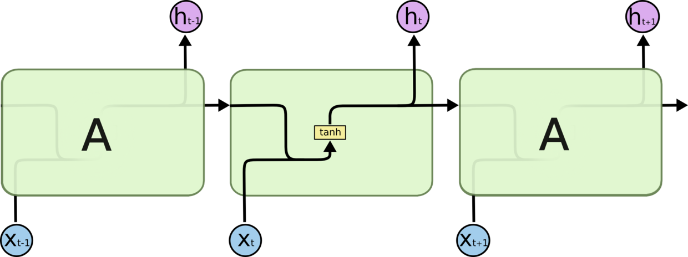
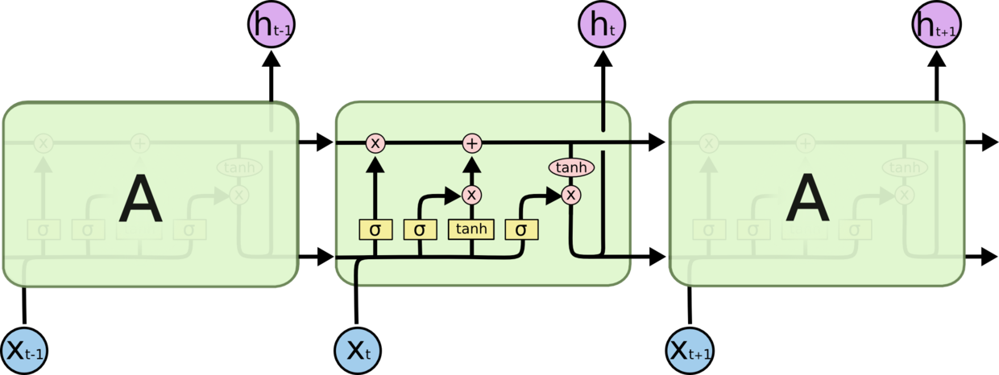
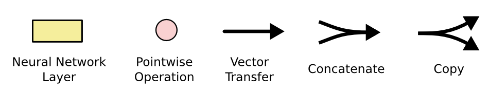
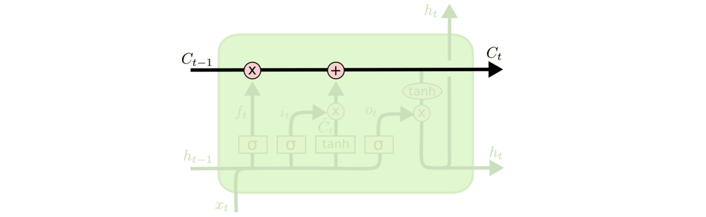
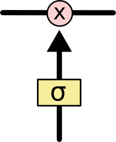
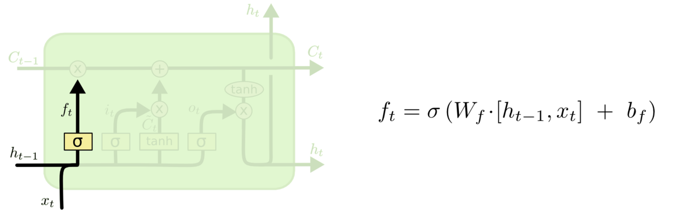
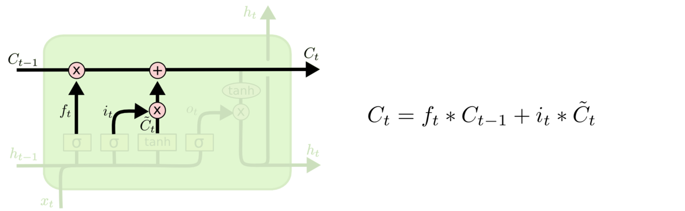
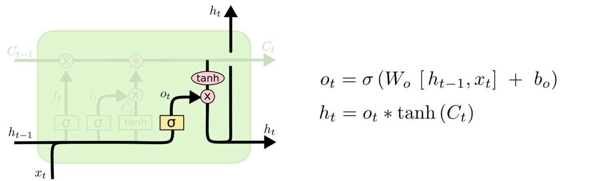

### 3.1 时间序列介绍

时间序列数据是对某一观测现象的某个指标在不同时间点上观测得到的数据，而时间序列就是将这些观测到的时间序列数据按照时间先后顺序排列起来形成的序列。时间序列分析就是对时间序列进行观察、研究，寻找它变化的规律，应用数理统计方法和概率论加以处理从而预测它将来的走势。在日常生产、生活中，时间序列比比皆是，时间序列有着非常广泛的应用领域 [22]。

时间序列分析是一种定量预测方法，它的基本原理是：1.承认事物发展的延续性。应用过去数据，就能推测事物的发展趋势。2.考虑到事物发展的随机性。任何事物发展都可能受偶然因素影响，为此要利用统计分析中加权平均法对历史数据进行处理。时间序列预测一般反映三种实际变化规律:趋势变化、周期性变化、随机性变化 [23]。现在，时间序列分析已经广泛应用于国民经济宏观控制、区域综合发展规划、企业经营管理、市场潜量预测、地震前兆预报、水文预报、农作物病虫灾害预报、气象预报、环境污染控制、生态平衡、天文学、海洋学、工程学以及物理学在内的多个领域[24]。

​    无论是公有云还是私有云，就目前的 IaaS 云而言，虚拟机的性能指标，申请虚拟机的延时充斥这各种不确定因素，面对这些挑战，如何做出正确的调度决策对于工作流成功率和经济花费至关重要，而调度决策的制定要求调度者对于云计算资源在未来可能的状态进行精确地预判。同时注意到时间序列分析技术已经充分应用于金融保险精算行业，作为一种应用性较强的技术，时间序列分析对于调度计划的制定，资源的分配，资源的购买都具有非常现实的意义。

​    随着时间序列分析技术的发展，用于时间序列分析的软件也迅速发展，目前常用于时间序列分析的软件有Matlab、Eviews、SAS/ETS、CATS、TSP、SPASS、R以及Gauss。同时，时间序列分析软件的迅速发展同时也带动了时间序列技术的进一步发展。

### 3.2 时间序列预测方法

时间序列预测自20世纪五六十年代被广泛研究后得到了长足的发展，目前常用的时间序列预测模型有滑动平均、趋势外推法、指数平滑法、灰色模型、BP神经网络及自回归移动平均。

**3.2.1 指数平滑法**

指数平滑法最早由C.C Holt 于1958年提出，后来经统计学家深入研究使得指数平滑法变得非常丰富，应用也相当广泛，一般有简单指数平滑法、Holt双参数线性指数平滑法、Winter线性和季节指数平滑法。指数平滑法是一种简单的、适用于预测短期数据的时间序列分析工具。它的基本思想是：根据时间序列的向前发展，依次计算一定项数的时序平均值，并依次反映长期的趋势。当数据既不快速增长也不快速下降，且不存在季节性因素时，移动平均法能够有效地消除预测中的随机波动，移动平均法根据预测时使用的各元素的权重不同，可以分为：简单移动平均、加权移动平均和指数移动平均。

**3.2.2 趋势外推法**

趋势外推法（Trend extrapolation）是根据过去和现在的发展趋势来预测未来的一类方法的总成，首先由R.莱恩（Rhyne）用于科技预测，他在[]指出要想应用趋势外推法进行预测，必须要进行一下6个步骤：1. 选择预测参数；2. 收集必要的数据；3. 拟合曲线；4.趋势外推；5. 预测说明；6. 研究预测结果在制定规划和决策中的应用。

趋势外推法的基本思想是：一个事物在过去发展的因素在很大程度上也决定了该事物未来的发展，而且这个发展不会太大；事物发展过程一般都是渐进式的变化，而不是跳跃式的变化掌握事物的发展规律，依据这种规律就可以预测出事物的未来趋势和状态。由此可见趋势外推法是一种基于回归分析的预测方法，目前已经广泛应用于科技、经济和社会发展的预测，同时也是情报研究法体系的重要部分。

**3.2.3 灰色模型**

灰色预测模型是通过少量的、不完全的信息，建立数学模型并作出预测的一种预测方法。当我们应用运筹学的思想方法解决实际问题，制定发展战略和政策、进行重大问题决策时，都必须对未来进行科学的预测、预测是根据客观事物的过去和现在的发展规律，借助于科学的而方法对其未来的发展趋势和状况进行描述和分析，并形成科学的假设和判断。

灰色系统理论是研究解决灰色系统分析、建模、预测、决策和控制的理论。灰色预测是对灰色系统所做的预测。目前常用的一些预测方法（如回归分析等），需要较大的样本，若样本较小，常造成较大误差，使预测目标失效。灰色预测模型所需建模信息量少，运算方便，建模精度高，在各种预测领域都有着广泛的应用，是处理小样本预测问题的有效工具。

和一般的预测方法有所不同，灰色预测模型是一种能够在信息不完整的前提下，利用有限的、离散的数据建立灰色预测模型。由于灰色预测模型需要的采样数据较少、计算量相对较小，因此，灰色预测模型适用于实时性要求高的应用中。在实际的应用中，常使用一阶单变量的线性微分方程模型 GM(1,1)作为等时间间隔预测应用的预测模型。

**3.2.4 自回归积分移动平均（ARMA）**

19 世纪的时间序列分析，常针对确定的事物，Yule 在 1927 年将随机性引入时间序列分析，提出每个时间序列都可看成一个随机过程的实现 [25]。基于这一观点，产生了许多时间序列模型。Slutsky、Walker、Yaglom 和 Yule 最先用公式表示自回归(autoregressive，AR)和移动平均(moving average，MA)的概念。柯尔摩格罗夫基于 Wold 分解定理提出了解决线性时间序列预测问题 [26]，所谓 Wold 分解定理，即任意一离散时间广义平稳随机过程，都可分解成为一个规则随机和一个可预测过程之和。Box 和 Jenkins 集成了前人之成果，并且提出了一个连贯的、通用的三步循环时间序列预测方法[27]，即模型识别、参数估计以及模型检验，对于现代时间序列分析和预测的理论与实践都具有重要意义，推动了自回归求和滑动平均(ARIMA)模型的广泛使用和扩展。ARMA 时间序列法的优点是所需历史数据少、工作量少，不需人工干预，预测过程可自动进行，计算速度快;不足之处是没有考虑服务性能变化因素，只致力于数 据的拟合，对规律性的处理不足，限制了其预测精度的提高，只适用于性能本身的变化比较均匀的短期预测。

**3.2.5 RNN**

Hopfiled于1982年提出了循环神经网络（RNN）[1]，它的前向网络结构是玻尔兹曼机和自编码网络，Jordan于1986年第一次提出对序列进行有监督的学习[2]，该结构有两个突出的特点：1.输出节点对隐藏节点也有反馈。2.隐层节点有自连接。

RNNs的目的使用来处理序列数据。在传统的神经网络模型中，是从输入层到隐含层再到输出层，层与层之间是全连接的，每层之间的节点是无连接的。但是这种普通的神经网络对于很多问题却无能无力。例如，你要预测句子的下一个单词是什么，一般需要用到前面的单词，因为一个句子中前后单词并不是独立的。RNNs之所以称为循环神经网路，即一个序列当前的输出与前面的输出也有关。具体的表现形式为网络会对前面的信息进行记忆并应用于当前输出的计算中，即隐藏层之间的节点不再无连接而是有连接的，并且隐藏层的输入不仅包括输入层的输出还包括上一时刻隐藏层的输出。理论上，RNNs能够对任何长度的序列数据进行处理。但是在实践中，为了降低复杂性往往假设当前的状态只与前面的几个状态相关。

在传统的神经网络中，我们假设所有的输入（包括输出）之间是相互独立的。对于很多任务来说，这是一个非常糟糕的假设。如果你想预测一个序列中的下一个词，你最好能知道哪些词在它前面。RNN之所以循环的，是因为它针对系列中的每一个元素都执行相同的操作，每一个操作都依赖于之前的计算结果。换一种方式思考，可以认为RNN记忆了到当前为止已经计算过的信息。理论上，RNN可以利用任意长的序列信息，但实际中只能回顾之前的几步。

RNN 的关键点之一就是他们可以用来连接先前的信息到当前的任务上，例如使用过去的视频段来推测对当前段的理解。如果 RNN 可以做到这个，他们就变得非常有用。但是真的可以么？答案是，还有很多依赖因素。有时候，我们仅仅需要知道先前的信息来执行当前的任务。例如，我们有一个 语言模型用来基于先前的词来预测下一个词。如果我们试着预测 “the clouds are in the sky” 最后的词，我们并不需要任何其他的上下文 —— 因此下一个词很显然就应该是 sky。在这样的场景中，相关的信息和预测的词位置之间的间隔是非常小的，RNN 可以学会使用先前的信息。

在理论上，RNN 绝对可以处理这样的 长期依赖 问题。人们可以仔细挑选参数来解决这类问题中的最初级形式，但在实践中，RNN 肯定不能够成功学习到这些知识。 Bengio, et al. (1994) 等人对该问题进行了深入的研究[3]，他们发现一些使训练 RNN 变得非常困难的相当根本的原因。

RNN可以看成一个在时间上传递的神经网络，它的深度是时间的长度！正如我们上面所说，“梯度消失”现象又要出现了，只不过这次发生在时间轴上。对于t时刻来说，它产生的梯度在时间轴上向历史传播几层之后就消失了，根本就无法影响太遥远的过去。因此，之前说“所有历史”共同作用只是理想的情况，在实际中，这种影响也就只能维持若干个时间戳。为了解决时间上的梯度消失，机器学习领域发展出了长短时记忆单元 LSTM，通过门的开关实现时间上记忆功能，并防止梯度消失

**3.2.6 LSTM 神经网络**

1997年 Sepp Hochreiter 和 Jurgen Schmidhuber 提出了长短期记忆（LSTM）模型 [29]，这个模型可以用来补救长期以来 RNN 存在的梯度爆炸问题。LSTM(长短时记忆)神经网络是建立在RNN上的一种新型深度机器学习神经网络，在输入、反馈与防止梯度爆发之间建立一个了长时间的时滞。这个架构强制其在特殊记忆单元中的内部状态保持一个持续误差流，这样一来梯度既不会爆发也不会消失。在这个模型中LSTM单元包含一个尝试将信息储存较久的存储单元。这个记忆单元的入口被一些特殊的门控制，被控制的功能包括保存、写入和读取操作。这些门都是逻辑单元，它们不会将自己的行为作为输入值发送给其他神经元，而是负责在神经网络的其它部分与记忆单元连接的边缘处设定权值。这个记忆单元是一个线型的神经元，有自体内部连接。具体来说就是其在每一个神经元内部加入了三个门，分别是输入门、输出门和忘记门。用来选择性记忆反馈的误差函数随梯度下降的修正参数。当忘记门被打开时(如1中的行为)，自己连接权值为1，记忆单元将内容写入自身。当忘记门输出为0时，记忆单元会清除之前的内容。输出门允许在输出值为1的时候，神经网络的其它部分将内容记入记忆单元，而输入门则允许在输出值为1的时候，神经网络的其它部分读取记忆单元。

### 3.3 LSTM 神经网络预测方法

Long Short Term 网络，一般就叫做 LSTM，是一种 RNN 特殊的类型，可以学习长期依赖信息。LSTM 由Sepp Hochreiter 和 Jurgen Schmidhuber 提出，并在近期被Alex Graves进行了改良和推广。在很多问题，LSTM 都取得相当巨大的成功，并得到了广泛的使用。

LSTM 通过刻意的设计来避免长期依赖问题。记住长期的信息在实践中是 LSTM 的默认行为，而非需要付出很大代价才能获得的能力！

### 3.3.1 LSTM 神经网络结构

所有 RNN 都具有一种重复神经网络模块的链式的形式。在标准的 RNN 中，这个重复的模块只有一个非常简单的结构，例如一个 tanh 层。

LSTM 同样是这样的结构，但是重复的模块拥有一个不同的结构。不同于 单一神经网络层，这里是有四个，以一种非常特殊的方式进行交互。

在上面的图例中，每一条黑线传输着一整个向量，从一个节点的输出到其他节点的输入。粉色的圈代表 pointwise 的操作，诸如向量的和，而黄色的矩阵就是学习到的神经网络层。合在一起的线表示向量的连接，分开的线表示内容被复制，然后分发到不同的位置。

LSTM 的关键就是细胞状态，水平线在图上方贯穿运行。
细胞状态类似于传送带。直接在整个链上运行，只有一些少量的线性交互。信息在上面流传保持不变会很容易。

LSTM 有通过精心设计的称作为“门”的结构来去除或者增加信息到细胞状态的能力。门是一种让信息选择式通过的方法。他们包含一个 sigmoid 神经网络层和一个 pointwise 乘法操作。

Sigmoid 层输出 0 到 1 之间的数值，描述每个部分有多少量可以通过。0 代表“不许任何量通过”，1 就指“允许任意量通过”！

LSTM 拥有三个门，来保护和控制细胞状态。

在我们 LSTM 中的第一步是决定我们会从细胞状态中丢弃什么信息。这个决定通过一个称为**忘记门层**完成。该门会读取 `h_{t-1}` 和 `x_t`，输出一个在 0 到 1 之间的数值给每个在细胞状态 `C_{t-1}` 中的数字。1 表示“完全保留”，0 表示“完全舍弃”。

让我们回到语言模型的例子中来基于已经看到的预测下一个词。在这个问题中，细胞状态可能包含当前**主语**的性别，因此正确的**代词**可以被选择出来。当我们看到新的**主语**，我们希望忘记旧的**主语**。

下一步是确定什么样的新信息被存放在细胞状态中。这里包含两个部分。第一，sigmoid 层称 “输入门层” 决定什么值我们将要更新。然后，一个 tanh 层创建一个新的候选值向量，`\tilde{C}_t`，会被加入到状态中。下一步，我们会讲这两个信息来产生对状态的更新。

在我们语言模型的例子中，我们希望增加新的主语的性别到细胞状态中，来替代旧的需要忘记的主语。

现在是更新旧细胞状态的时间了，`C_{t-1}` 更新为 `C_t`。前面的步骤已经决定了将会做什么，我们现在就是实际去完成。

我们把旧状态与 `f_t` 相乘，丢弃掉我们确定需要丢弃的信息。接着加上 `i_t * \tilde{C}_t`。这就是新的候选值，根据我们决定更新每个状态的程度进行变化。

在语言模型的例子中，这就是我们实际根据前面确定的目标，丢弃旧代词的性别信息并添加新的信息的地方。

最终，我们需要确定输出什么值。这个输出将会基于我们的细胞状态，但是也是一个过滤后的版本。首先，我们运行一个 sigmoid 层来确定细胞状态的哪个部分将输出出去。接着，我们把细胞状态通过 tanh 进行处理（得到一个在 -1 到 1 之间的值）并将它和 sigmoid 门的输出相乘，最终我们仅仅会输出我们确定输出的那部分。

在语言模型的例子中，因为他就看到了一个 **代词**，可能需要输出与一个 **动词** 相关的信息。例如，可能输出是否代词是单数还是负数，这样如果是动词的话，我们也知道动词需要进行的词形变化。

### 3.3.2 LSTM向前传播算法

现在我们来总结下LSTM前向传播算法。LSTM模型有两个隐藏状态$h^{(t)},C^{(t)}$，模型参数几乎是RNN的4倍，因为现在多了$W_f,U_f,b_f,W_a,U_a,b_a,W_i,U_i,b_i,W_o,U_o$这些参数。

前向传播过程在每个序列索引位置的过程为：

1. 更新遗忘门输出：

$$
f^{(t)}=σ(W_f h^{(t−1)}+U_f x^{(t)}+bf)
$$

2. 更新输入门两部分输出：

$$
i^{(t)}=σ(W_i h^{(t−1)}+U_ix^{(t)}+b_i) \\
a^{(t)}=tanh(W_a h^{(t−1)}+U_a x^{(t)}+b_a)
$$

3. 更新细胞状态：

$$
C^{(t)}=C^{(t−1)}⊙f^{(t)}+i^{(t)}⊙a^{(t)}
$$

4. 更新输出门输出：

5. $$
   o^{(t)}=σ(W_o h^{(t−1)}+U_o x^{(t)}+b_o) \\
   h^{(t)}=o^{(t)}⊙tanh(C^{(t)})
   $$

   ​

6. 更新当前序列索引预测输出：

$$
\hat{y}^{(t)}=σ(Vh^{(t)}+c)
$$

### 3.3.3 LSTM反向传播算法

有了LSTM前向传播算法，推导反向传播算法就很容易了， 思路和RNN的反向传播算法思路一致，也是通过梯度下降法迭代更新我们所有的参数，关键点在于计算所有参数基于损失函数的偏导数。

在RNN中，为了反向传播误差，我们通过隐藏状态$h(t)$的梯度$δ(t)$一步步向前传播。在LSTM这里也类似。只不过我们这里有两个隐藏状态$h(t)$和$C(t)$。因此这里我们要定义两个$δ$来一步步反向传播，即：
$$
δ^{(t)}_h=\frac{∂L}{∂h^{(t)}} \\
δ^{h(t)}_C=\frac{∂L}{∂C^{(t)}}
$$
而在最后的序列索引位置τ的$δ^{(τ)}_h$和$δ^{(τ)}_C$为：
$$
δ^{(τ)}_h = \frac{∂L}{∂o^{(τ)}} \times \frac{∂o^{(τ)}}{∂h^{(τ)}}=V^T(\hat{y} (τ)−y(τ)) \\
δ^{(τ)}_C = \frac{∂L}{∂h^{(τ)}} \times \frac{∂h^{(τ)}}{∂C^{(τ)}}=δ^{(τ)}_h⊙o^{τ}⊙(1-tanh^2(C^{(τ)})
$$
$δ^{(t)}_h$的反向推导和RNN中的类似，因为它的梯度误差由前一层$δ^{(t+1)}_h的$梯度误差和本层的输出梯度误差两部分组成，即：
$$
δ^{(t)}_h=\frac{∂L}{∂o^{(t)}} \times \frac{∂o^{(t)}}{∂h^{(t)}} + \frac{∂L}{∂h^{(t+1)}} \times \frac{∂h^{(t+1)}}{∂h^{(t)}} =V^T\hat{y} (t)−y(t)  + W^Tδ^{(t+1)}diag(1-h^{(t+1)^2})
$$
而$δ^{(t)}_C$的反向梯度误差由前一层$δ^{(t+1)}_C的$梯度误差和本层的从$h^{(t)}$传回来的梯度误差两部分组成，即：
$$
δ^{(t)}_C=\frac{∂L}{∂C^{(t+1)}} \times \frac{∂C^{(t+1)}}{∂C^{(t)}} + \frac{∂L}{∂h^{(t)}} \times \frac{∂h^{(t)}}{∂h^{(t)}} =δ^{(t+1)}_h⊙f^{(t+1)}+δ^{(t)}_h⊙o^{(t)}⊙(1-tanh^2(C^{(t)})
$$
有了$δ^{(t)}_h$和$δ^{(t)}_C$，计算这一大堆参数的梯度就很容易了，这里只给出$W_f$的梯度计算过程，其他的$U_f,b_f,W_a,U_a,b_a,W_i,U_i,b_i,W_o,U_o,b_o,V_c$的梯度大家只要照搬就可以了。
$$
\frac{∂L}{∂W_f} =\sum_{t=1}^{τ}\frac{∂L}{∂C^{(t)}} \times \frac{∂C^{(t)}}{∂f^{(t)}} \times \frac{∂f^{(t)}}{∂W_f} = δ^{(t)}_C ⊙C^{(t-1)}⊙f^{t}(1-f^{(t)})(h^{(t-1)})^T
$$

###  参考文献

[1] J J Hopfield. Neural networks and physical systems with emergent collective computational abilities[J]. Proceedings of the National Academy of Sciences of the United States of America, 1982, 79(8):2554.

[2] Jordan M I. Serial order: A parallel distributed processing approach.[J]. 1986, 121:64.

[3] Bengio Y, Simard P, Frasconi P. Learning long-term dependencies with gradient descent is difficult.[J]. IEEE Transactions on Neural Networks, 1994, 5(2):157.

