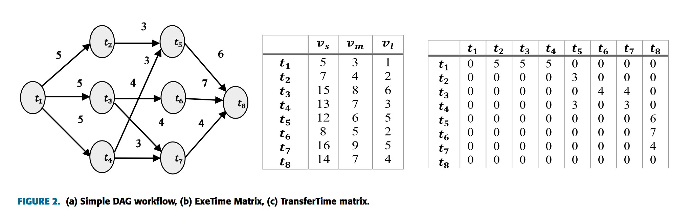

### 4.1 应用模型

**定义1：科学工作流**

通常，对于每一个需要调度的科学工作流 $W$ 来讲，应用管理者都会与用户签订 SLA 协议，协议中规定了服务的质量，如保证概率至少为 $r$ 的截止时间完成率。

一个具有 SLA 约束的科学工作流可以使用一个有向无环图 $ W =(T，E)$ 来表示，其中 $T=(t_1,t_2, …, t_m)$是任务的集合，$E$ 是边集。边 $e_{i,j}$ 连接任务 $t_i，t_j$，$t_i，t_j \in T$ 且 $t_i \neq t_j$ ，$e_{i,j}$ 它表示了任务 $t_i$ 和 $t_j$ 之间的数据控制依赖性，$t_i$ 是 $t_j$ 父任务，$t_i$ 和 $t_j$ 之间的父子关系表明了 $t_j$ 的只有在任务 $t_i$ 完成后才有可能执行。

每个有向无环图 $W$ 只有一个入口任务 $t_{enter}$ 和一个退出任务 $t_{exit}$，入口任务 $t_{enter}$ 没有父任务，退出任务$t_{exit}$ 没有子任务，如果工作流中有多个入口任务和退出任务，那么虚拟入口任务或者虚拟退出任务就应该被插入到这个工作流中，使得整个图只有一个入口任务和一个退出任务。

一个简单的DAG图如图2（a）所示，图2（b）显示的是不同类型的虚拟机执行任务所花费的时间，图2（c）表示任务与任务之间传输数据所花费的时间。

**定义2：任务**

科学工作流中的一个任务可以用一个三元组来表示，$t_i = (index, ST_i, FT_i)$，其中 $index$ 是任务 $t_i$ 的执行顺序，我们把一个完整有向无环图中的所有任务任务按照执行的先后顺序从 $1$ 到 $m$ 进行标记（如图2（a）所示）。对于任意的任务 $t_i$ 和 $t_j$，且有 $i<j$ ，除非任务 $t_i$ 和 $t_j$ 被映射到同一台虚拟机上执行， $i<j$ 并不代表着任务 $t_i$ 一定在任务 $t_j$ 之前执行，但是 $t_1$ 一定是入口任务 $t_{enter}$，$t_m$ 一定是退出任务 $t_{exit}$ 。

**定义3：父任务和子任务**

任务 $t_i$ 的父任务是指它的所有前驱任务，任务 $t_i$ 的子任务是指它的所有后继任务，，如公式1和2所示，任务 $t_i$ 的所有父任务和子任务由 $ Pred(t_i)$ 和 $Succs(t_i)$ 表示:
$$
Pred(t_i) = \{ t_j|t_j\in T \wedge (t_j,t_i)\in E  \} \\
Succ(t_i) = \{ t_j|t_j\in T \wedge (t_i,t_j)\in E  \}
$$

### 4.2 云资源模型

IaaS云计算资源提供商通过互联网以虚拟机（VM）的形式向科学工作流的执行提供高性能计算资源。提供商会根据用户请求创建一系列虚拟机供用户使用，并按照协商好的计费方式进行计费。请求的每台虚拟机都可以有不同的配置，如CPU类型，内存大小，每个计费时间段的费用等等，虚拟机的花费也取决于它的配置，配置越高价格就越贵。

**定义4：虚拟机类型**

虚拟机的类型可以用一个二元组来表示，如虚拟机 $vm_k$ 的类型为 $vt_j$，可以表示为：
$$
Type(vm_k) =vt_j= (ET_{t_i}^{vt_j}, price_{vt_j}) \\
ET_{t_i}^{vt_j} = PRD(T_{t_i}^{vt_j})
$$
其中 $ET_{t_i}^{vt_j}$表示任务 $t_i$在类型为 $vt_j$ 的虚拟机上的预计运行时间， $T_{t_i}^{vt_j}$ 是任务 $t_i$ 在类型为 $ vt_j $ 的虚拟机上运行时间的历史数据，函数$PRD$ 表示基于LSTM神经网络时间序列的预测方法，$ET_{t_i}^{vt_j}$ 的值将作为下一章调度算法的输入。

$price_{vt_j}$ 表示类型为 $vt_j$ 的虚拟机每单位计费时间的价格。

**定义5：数据传输时间**

假设任务 $t_i$ 为 任务$t_j$ 的父任务，且任务 $t_i$ 在类型为 $vm_k$ 的虚拟机上执行，而任务 $t_j$ 在类型为 $vm_v$上的虚拟机上执行，如公式（4）所示，两者之间的数据传输时间可以表示为 $TT(e_{i,j})$
$$
TT(e_{i,j}) = \frac{Data(t_i, out)}{\beta}
$$
数据传输时间 $TT(e_{i,j})$ 等于传输的数据量除以两种类型虚拟机的平均传输速度。如果两个任务在同一台虚拟机上被执行，那么传输时间为 $0$。

注意到，本文的云计算模型类似于亚马逊提供的IaaS服务，如AWS弹性云计算（EC2）提供计算资源和AWS弹性块存储（EBS）来发送和接受中间输入、输出文件。我们假设所有的存储和计算服务都在同一个数据中心。因此共享存储服务和VM之间传输数据的平均带宽大致相等。此外，还假设客户端对于大规模科学工作流程租用的虚拟机实例的数量没有限制。另外，当虚拟机被租用时，它需要一个初始启动时间（请求延迟）才能正确的初始化，然后才能向最终用户提供，当它被释放时，它也需要一些时间才能正常关闭（终止延迟）。虽然云计算提供商会按照用户的资源实际使用量进行收费，但是大多数的服务提供商会向用户收取一整个计费时间的费用，如果用户只是用了计费单元时间的一小段。因此，本文使用每分钟基准时间间隔来计算每个租用的虚拟机的执行成本。并且，内部数据传输成本假定为零，因为内部数据传输在大多数云数据中心都是免费的。下一节将定义云计算环境中工作流调度的问题

### 4.3 科学工作流调度模型

科学工作流调度算法根据工作流状况，资源的类型和用户的质量约束生成调度计划，这个调度计划指定了工作流内任务在哪个虚拟机上执行，什么时候执行，执行的先后顺序。

**定义6：科学工作流调度计划**

一个科学工作流调度计划 $S$ 可以用一个四元组表示：$S = \{VM_{set}, Map, TET, TEC \}$。其中 $VM_{set} = \{ vm_1, vm_2, … vm_n \}$ 表示需要租赁的所有虚拟机的集合。$Map = \{map(t_1), map(t2), …map(t_i) \}$ 表示所有任务的资源映射计划。$TET$ 表示该工作流总执行时间，$TEC$ 表示执行总花费。

**定义7：虚拟机的租赁**

执行科学工作流所需租赁的每一台虚拟机可以用一个三元组表示，$vm_k = \{ vt_j, LST_K, LET_k\}$，其中 $vt_j$ 表示这台虚拟机的类型，$LST_K$ 和 $LET_k$ 分别代表这台虚拟机租用的时间段。

**定义8：任务资源的映射**

$Map = \{map(t_1), map(t2), …map(t_i) \}$ 代表一次完整的科学工作流调度的所有任务的映射，不同任务有可能被映射到不同的虚拟机上，也有可能被映射到同一台虚拟机上。对于某个任务 $t_i$ 的一次映射可以用三元组  $map(t_i) = (vm_{t_i}, ST_{t_i}, FT_{t_i})$  来表示，其中 $vm_{t_i}$ 代表任务 $t_i$ 被调度到的虚拟机，$ST_{t_i}$ 和 $FT_{t_i}$ 分别代表任务 $t_i$ 的开始时间和完成时间，对于 $ST_{t_i}$ 和 $FT_{t_i}$ 有：
$$
FT_{t_i} = ST_{t_i} + ET_{t_i}^{Type(vm_{t_i})}
$$
$Tpye(vm_{t_i})$ 为虚拟机 $vm_{t_i}$ 的类型，$ET_{t_i}^{vt_j}$ 为定义4中任务 $t_i$在虚拟机 $vm_k$ 上的预计运行时间。

对于 $ST_{t_i}$，设在任务 $t_i$ 之前的任务都被影射到同一台虚拟机上且这些任务现在已经不占用虚拟机的时间为 $tav({t_i})$，任务 $t_i$ 之前的任务被映射到不同的虚拟机上并且这些任务都已经完成了数据传输（任务 $t_i$ 现在可以立即执行）的时间为 $hold({t_i})$，有：
$$
tav({t_i}) = max\{ FT_{t_j} | j<i \ \wedge  vm_{t_i} = vm_{t_j}\} \\
hold({t_i}) = max \{ FT_{t_j} + TT(e_{j,i}) | t_j \in Pred(t_i) \}
$$
其中 $Pred(t_i)$ 是任务 $t_i$ 的所有前驱任务，即在科学工作流 $W$ 中有边直接与 $t_i$ 节点相连的那些节点。因此，任务 $t_i$ 的最早执行时间 $ete(t_i)$ 可以由公式（6）得到：
$$
ete(t_i) = max \{ tav(t_i), hold(t_i) \}
$$
由以上的推断，$ST_{t_i}$ 可以由一下公式得到：
$$
ST_{t_i}=\left\{
\begin{array}{rcl}
ete(t_i)       &      & {if\ ete(i) \ge LST(vm_{t_i})  \wedge  ete(i) + ET_{t_i}^{vt_j} \le LET(vm_{t_i})}\\
\infty    &      & {else}
\end{array} \right.
$$
其中 $LST(vm_{t_i})$ 和 $LET(vm_{t_i})$ 是虚拟机 $vm_{t_i}$ 租赁的开始和结束时间。入口任务 $t_1$ 没有前置任务，因此它的结束时间可以由此得到：
$$
FT_{t_1} =ET_{t_1}^{Type(vm_{t_1})} + ST_{t_1} \\
= ET_{t_1}^{Type(vm_{t_1})} + stp
$$
其中 $stp$ 代表工作流初始化和预处理的启动时间。