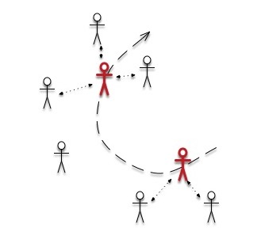

# QoS-Oriented Self-Organized Mobile Service Composition Over Oppotunistic Networks

## ABSTRACT

## I INTRODUCETION

​	In recent years, service-oriented computing has become an increasingly important computing paradigm to develop and integrate distributed enterprise information systems [T]. 

​	With the rapid developments of mobile devices and wireless communication technologies, web services are no longer limited to traditional platforms and they are becoming more flexible and pervasive **[2]**. 

​	The manufacturers of mobile devices will continue make breakthroughs to extend mobile devices’ capabilities in terms of memory, computational power, storage capacity, and so on. Mobile technology’s huge potential brings great opportunities for traditional service computing in the mobile environment **[7]**, As a result, the global interest of mobile applications is on the rise. Both researchers and industrial companies are inspired to pave the road for mobile Web service provisioning [T] **[2]**.

​	While mobile device have powerful computing and communication capabilities, the high data rate services, however, drain out the energy of the device much faster than before **[Call for Papers]**. 	

​	To achieve the goal of reduction of energy consumption, in this paper we advocate a QoS-oriented selforganized mobile service composition approach , where a mobile user in opportunistic can combine and exploit each other’s resources to boost their computing power and overcome the limitations of their own resources without the communication energy footprint and the extreme centralization of mobile cloud computing (As shown in fig.1) **[1]**, 

​	Its main rationality is four-fold. First, opportunistic user encounters are prevalent and sufficient in daily life [T], which offers plenty of opportunities to exploit nearby human intelligence for task solving [T], [T], [T]. Second, many mobile tasks require huge computational resources and require high timeliness  (e.g., Tensorflow on mobile, Photoshop on mobile, Game on mobile), and hence nearby human workers are more adept at executing them than the online workers. Third, D2D communications such as Bluetooth, WiFi-direct and LTE-D2D are promising to replenish traditional cellular communications in terms of user throughput increase, cellular traffic reduction and network coverage extension [T]. At last, this framework shares the similar spirit with the emerging paradigm “cyber foraging” over opportunistic networks, such that mobile users opportunistically exploit nearby device resources to facilitate their computational task processing [T] **[3]**.

**Contribution [2]**

​	To address the aforementioned challenges and concerns, we propose a new approach for service selections and compositions in mobile environments. The main contributions are:

1. We propose an architecture for mobile service provision [mobile service sharing community (MSSC)] to address the problem of service selection for mobile service com- position in the mobile community where both service requesters and providers are nonstationary. In such com- munity, mobile users can share mobile services through their mobile devices in specific areas. **改写为移动机会网络**
2. For MSSC, we propose a mobility model to describe mobile user moving behavior. The model is extended from the random waypoint (RWP) model. **改写节点可用性**
3. Based on MSSC and the proposed mobility model, we transfer the mobility-aware service composition prob- lem to an optimization problem and propose to utilize the Krill-Herd (KH) algorithm to solve it. We conduct aseries of evaluations to validate that our algorithmis approximately optimal and performs much better than other standard composition approaches. We compare it with other population-based optimization methods for both optimality and scalability. **改良GA算法，加入对比试验**

**Arrangement**

​	The remainder of this paper is organized as follows. Section II reviews the related work. Section III introduces the 	MSSC architecture. Section IV describes our approach to make service compositions. Section V presents experimental results. Section VI concludes this paper.

## II APPLICATION SCENARIO

In this section, we introduce MSSC that is a virtual community formed by multiple mobile users. Within it, users can share services on their own mobile devices through mobile networks. It has three main characteristics as follows **[2]**.

1. Locality: An MSSC is not established on the Internet. It corresponds to a specific region such as a univer- sity campus, a company building, and a restaurant. Only mobile users who enter the same region can share services with each other. **（改本地性）**
2. Dynamicity: MSSC participants are not stationary. They can enter or leave the community at any time.
3. Mobility: Services provided by mobile users are not fixed at the same location. Service requesters are also mobile when invoking a mobile service.

​	Fig. 1 illustrates the working procedure of the Crowd Foraging framework. In an opportunistic network scenario, a mobile task requester R launches a mobile crowdsourcing task. She moves around in the network and opportunistically encounters a mobile human worker W1. After probing the work ability of the worker W1 via D2D link, if the task requester R decides to recruit the worker in terms of a specific recruitment policy, she will forward the detailed contents of the task (e.g., images, videos and text descriptions) to the recruited worker via D2D link. Once the worker finishes the task, he will send the results to the task requester via either cellular link directly or D2D link when they encounter with each other again before a given deadline. Finally, the task requester receiving the results will grant the task reward to the worker. We should emphasize that, our framework only considers one-hop mechanism for both worker recruitment and result collection, since realistic dataset analyses reveal that users’ one-hop neighbors are sufficient [7] and can cover most range of the whole network in a reasonable time period [10], and contacting a user would incur long delay if the maximum D2D communication hops are larger than two [15]. Compared with multi-hop mechanisms in existing researches [1], [3], [4], [6], [11], [12], this one-hop feature can lower the network overhead (e.g., no need to transfer a large volume of task contents hop by hop) and ensure framework performance with only local information, which is more practical in real life **[3]**.

​	In an MSSC, the above service operations are all handled on requesters’ mobile devices. A composer can be implemented and deployed on the requester’s mobile device, which is in charge of discovering available mobile services nearby, composing multiple services, and selecting appropriate service candidates for composition tasks. Note that the service candidates are selected for all the tasks before the execution of the composition. During the execution of mobile service compositions, all the component services interact with the composer directly. The communication among mobile devices is based on Bluetooth, WLAN, or other available device- to-device communication protocols and the communication between two mobile devices is single-hop. Hence, once two mobile devices are out of their sensing distance, they would lose the connection **[2]**.

​	In this section, we use an example depicted in Fig. 1 to illustrate the related features of the problem of RMSC.
​	A mobile user Tom is visiting a national park and record a video of the park. Now he wants to cut a clip of the video and add some effects and speech for the video clip. But he has no such services on his own device. As one option, he can upload the video to cloud services to get the video clip. But the national park is in a rural area where the signal cover- age is not so good. So the video transmission may take long time or even fail. If a video processing service is provided by some nearby mobile devices, Tom has other options to invoke such mobile services on nearby mobile devices through free near field communication techniques. If one service cannot meet his requirement, several services can be composed. For example in Fig. 2, at most three services are needed: 1) video cutting service; 2) video beautifying service; and 3) video dub- bing service. Due to users’ mobility, the availability of service providers to Tom can vary. So invoking services provided by other mobile users may face new challenges that traditional composition methods cannot handle.
​	First, there exists risk of failure that invoking services provided by mobile users. Due to the limited range of the communication among mobile devices, Tom can only invoke services provided within the required communication distance of the mobile devices. Meanwhile, the other users who are also visiting the gallery keep moving in and out the required dis- tance uncertainly. As a result, there exists risk that the service provider moves out of range when the service is being used, then the composition fails and a recomposition is needed.
Second, there is limited work dealing with users’ mobil- ity when making service composition in mobile environment. Then once the generated composition solution fails when the service provider moves out of the required communication distance, it needs to recompose services for the target user.
To minimize the risk of composition fails and avoid fre- quent recomposition, we need to select a service provider with enough availability time for each service such that the com- position can exist to finalize. We refer to a composition with such requirement as a risk-aware service composition. The dif- ficulty for it is the mobility of service requesters and providers. For existing selection methods for service composition, only properties of candidate services are considered. But the mobil- ity of service providers and requesters is ignored. Therefore, the risk of failure of the obtained composition is hardly con- trolled. In this paper, we target at solving the RMSC in the above application scenario **[9]**.

​	Assume a mobile user Tom wants to invoke a hotel booking service when he is walking from base station A to base station B. Assume that the signal strength of B is stronger than A, the average data transmission rate be- tween Tom’s cellphone and A is 10 Kbps, and the data transmission rate between Tom’s cellphone and B is 20 Kbps. A virtual service provider sp is responsible for se- lecting the service with the best response time for Tom. sp can get the functional and non-functional attributes of service candidates from UDDI. It can also obtain knowledge of the mobile network capability directly from the telecom service provider or from some third parties that monitor signals such as Opensignal2. Thus, sp can make a selection for Tom based on the acquired infor- mation. Suppose that sp finds two candidates that can provide hotel booking service, Ctrip and Elong, which are well-known hotel booking services in China. sp would make the selection decision for Tom depending on the QoS of each service. The booking confirmation wait time is 100 s for Ctrip and 120 s for Elong **[10]**.

**修改方向：**

1. Mobile data traffic sharing
2. Computing heavy task distribution
3. 要说明出存在的问题，为下文问题的描述做铺垫

## III MOBILE SERVICE COMPOSITION MODEL

​	This section provides clear definitions for all key concepts related to RMSC in this paper **[9]**.

#### A. Preliminaries

​	In order to describe the problem addressed in this paper, we first provide the basic concepts of mobile service composition based on the proposed mobility model.

***Definition 1 (Mobile Service):*** A mobile service is a triple $s = (id, Fun, QoS)$, where:

​	1) $id$ is the unique identifier of the service;

​	2) $Fun$ is the set of functions s provides, a function includes the input, output, precondition and result of the service;

​	3) $QoS = \{q\}^n_{j=1}$ is a set of quality attributes, including execution cost, response time, reliability, availability, etc **[9]**.

***Definition 2 (Mobile Service Provider):*** A mobile service provider is a tuple $sp = (id, S)$, where:

​	1) $id$ is the unique identifier of the provider;

​	2) $S$ is the set of mobile services $p$ provides **[9]**.

***Definition 3 (Service Composition Plan):*** A service composition plan is a tuple $scp = (L, G)$, where:

​	1) $L = \{l_1,l_2,…,l_n\}$ is a set of tasks;

​	2) $G = \{g(l_i,l_j)|l_i,l_j \in L\}$ is a set of relations between tasks in $L$.

​	A service composition plan is an abstract description of a business process. Each task li can be realized by invoking an individual service. There may be multiple services with different QoS that can be adopted to fulfill each task. G is used to describe the structure of the composition. $g(l_i, l_j) = 1$ represents that the inputs of $l_j$ depend on the outputs of $l_i$ **[9]**.

***Definition 4 (Mobile Service Composition):*** A mobile service composition is a tuple $sc = (scp, S)$ where:

​	1) $scp$ is the corresponding service composition plan;

​	2) $S$ is the set of component services selected for each taskin $scp$ **[9]**.

#### B. Concept of Node Availability

​	In wireless mobile networks such as ad hoc or mesh networks, the availability of a node to its neighbour nodes is highly related to the node’s mobility—here it is assumed that battery power is not a concern and as such a node will not out of reach because of battery exhaustion. If node i moves outside the transmission range of its neighbouring node j, then node i is unreachable by node j and as a result the services on node i become unavailable to node j either. Node availability, to some extent, also expresses network availability because if the connection between any two neighbouring nodes in a route from a service provider to a service requester becomes unavailable, then the whole route also becomes unavailable. Here node mobility is utilized to calculate the node availability **[4]**.

​	Consider, as illustrated in Fig. 2, two mobile hosts MHi and MHj of the same transmission range R. Each node moves randomly and it is assumed that the moving field is a circle with a radius of r. d represents the distance between MHi and MHj. These three parameters are to be used for calculating the node availability. The transmis- sion range of a node R is known (e.g., pre-defined or changing according to certain algorithm). Suppose the location (i.e., coordinates) of each mobile host is known (e.g., via GPS—global positioning system), then distance d can be calculated using the Euclidean distance formula, i.e.,$\sqrt{{(x_i-x_j)^2}+{y_i-y_j}^2}$ where $(x_i, x_j)$ and $(y_i, y_j)$ are are the coordinates of MHi and MHj respectively. Finally let us discuss how to calculate r **[4]**.

​	The moving radius of a mobile host (r) is its speed (s) multiplied by the average service time (t). Here t can be statistically calculated as the average value of last n servings of this component service, namely, $t = \Sigma_{i=1}^{n}t_i/n$. The speed of a mobile host s can be calculated based on its moving distance during a period from t1 to t2 [18], namely: $s = \sqrt{{(x_i-x_j)^2}+{y_i-y_j}^2}/(t_2-t_1)$. Then $r = s \times t$ **[4]**.

​	Knowing the values of these three parameters R, r, and d, the probability of MHi staying inside the transmission range of MHj (denoted as $P_i^{IN}$ ) can be calculated by
$$
P_i^{IN} = \frac{A_i^{IN}}{A_i^T}
$$
​	Namely, $P^{IN}_i$ equals to the area of the MHi’smoving field inside the transmission range of MHj (denoted as $A^{IN}_i$) divided by the overall area of the MHi’s moving field ($A^T_i$) **[4]**.

​	As shown in Fig. 2, we have	
$$
\alpha = arcons(\frac{r^2+d^2-R^2}{2r\times d}) \\
\beta = arcons(\frac{R^2+d^2-r^2}{2r\times d})
$$
​	Then, 	
$$
A^{IN}_i = [(\frac{2\beta}{2\pi}\pi R^2)-(\frac{R sin\beta cos\beta}{2}2)]\\\nonumber
+ [(\frac{2\alpha}{2\pi}\pi r^2)-(\frac{r sin\alpha cos\alpha}{2}2)]\\\nonumber
= \beta R^2 + \alpha r^2 - (R^2 sin\beta cos\beta + r^2 sin\alpha cos\alpha)
$$
​	There is also
$$
A_i^T = \pi r^2 = \pi \times (s \times t)^2
$$
​	Therefore, we obtain
$$
P_i^{IN} = \frac{A_i^{IN}}{\pi s^2 t^2}
$$
​	The probability of MHi staying inside the transmission range of $MH_j (P^{IN}_i)$ can be calculated. Suppose service $s$ running on MHi is a candidate service for a task running on MHj, and the node availability with regard to service s is denoted as $q_{av}^n(s)$, then finally there is
$$
q_{av}^n(s) = P^{IN}_i = \frac{A_i^{IN}}{\pi s^2 t^2}\\\nonumber
= \frac{\beta R^2 + \alpha r^2 - (R^2 sin\beta cos\beta + r^2 sin\alpha cos\alpha)}{\pi s^2 t^2}
$$
**修改方向：**

1. 说明最后的指标的含义（表示服务在未来的连通性）
2. 将最后的指标列为一个重要的服务选择指标

#### C. QoS Model for Service Composition

For service providers to meet the requirements of ser- vice consumers, they must consider QoS [39]–[41]. Common QoS attributes include response time, price, reliability, and availability, and they can be classified into two categories: 1) positive and 2) negative (denoted as Q+ and Q−). For positive attributes, larger values indicate better performance (e.g., reliability and availability), while for negative attributes, smaller values indicate better performance (e.g., price and response time).
​	For a composite service instance, the value of each QoS attribute is determined by the QoS values of its concrete com- ponents and orchestration patterns. Table I lists the aggregation functions for response time, price, and reliability for sequen- tial, parallel, choice, and loop composition patterns, where pj represents the execution probability of the jth branch state- ment in the choice structure, and k is the expected number of iterations of the loop. More aggregation functions can be found in [42] and [43]. QoS aggregation functions are always monotone; i.e., higher (lower) values produce a higher (lower) overall result.
​	For a composite service consisting of multiple component services and various composition patterns, the overall value of each QoS attribute can be calculated by following the standard parse tree from bottom to up and applying the corresponding aggregation functions.
​	In order to facilitate ranking of different composite service instances in terms of QoS, simple additive weighting (SAW) is used as the QoS utility function to map the QoS vector into a real value. SAW first normalizes the QoS attribute values into real values between 0 and 1, through comparison with the maximal and minimal values; then it sums the normalized values multiplied with a preference weight wt. According to SAW, the QoS utility of a composite service instance csi can be calculated using (1), where, qt(csi) is the aggregated value of the tth QoS attribute of csi, and qt,max and qt,min, respectively, denote the maximal and minimal possible aggregated values of the tth QoS attribute
$$
U(csi) = \sum_{q_t \in Q^-} \frac{q_{t,max}-q_t(csi)}{q_{t,max}-q_{t,min}}\times w_t \\
+\sum_{q_t \in Q^+} \frac{q_t(csi)-q_{t,max}}{q_{t,max}-q_{t,min}}\times w_t
$$

#### D. Problem Formulation

***Definition 7 (MSSC Service Composition):*** Given a mobile service sharing community mssc, and a service composition request $h$ by a mobile user $u$, select concrete services provided by other mobile users in MSSC to achieve an optimal service composition msc with the shortest response time $L$. Meanwhile, msc should guarantee to run successfully when the service requester and the service providers are moving **[2]**.

***Theorem 1:*** The service composition problem in MSSC (Definition 7) is NP-hard.

***Proof:*** The standard integer program to find the smallest value of a given objective function $F( \Theta)$ with a feasiable parameter follows [21]:
$$
inf \ F(\Theta)\\
subject \ to \ \theta_I \in\{1,2,3,...,N\}
$$
​	This means that the feasible set of parameter vectors is constrained by $\theta_i \in {1, 2, . . . , N}$ with integer values. The optimal solution  $\Theta*$ satisfies the following conditions.

​	1)  $\Theta *$ belongs to the feasible set.

​	2) $\forall \Theta, F(\Theta) \le F(\Theta)$

​	For the problem of selecting optimal services with shortest response time while considering mobility, the vector   $\Theta= (θ_1, . . . , θ_n)$ can describe a possible solution as a service composition with $n$ tasks. An element $θ_i$ in   corresponds to a selected service from the candidates for the ith task. The evaluation function for the parameter vector  is as follows:

​	The target of the mobile service composition problem in MSSC is to find  to obtain the smallest $F( \Theta)$. Thus, the problem is equivalent to the integer program described in (2). An integer programming problem is known to be NP-hard. Then the service composition problem in MSSC is NP-hard.

​	For such a problem, integer programming can be utilized to obtain the optimal solution. However, they might cost much time when the problem size increases. In mobile environment, the requirement on runtime is essential since the environment parameters for computation may vary much within a short time. Therefore, although integer programming can obtain the optimal result, it is not suitable to the problem due to its poor scalability. So one possible way to obtain a satisfactory solu- tion in an accepted execution time is to design a heuristic search method and find the near optimal solution. For exam- ple, metaheuristic algorithms such as GAs and PSO, can be utilized to solve this problem. Among them, we find that KH algorithm can reduce the search space and return high approximate optima. Thus, we propose a solution method based on it to find an approximate optimal solution in polynomial time **[2]**.

## IV Composition Algorithm

​	A genetic algorithm (GA) is a search heuristic that mimicsthe process of natural evolution and it is widely employedas the optimization algorithm (Engelbrecht 2007). Someresearchers have applied GA to solve the problem of opti-mal service selection, and it achieves good performance(Canfora et al. 2005; Ma and Zhang 2008; Syu et al. 2011; Wuet al. 2012). However, standard genetic algorithm is prone topremature convergence on local optimum and all individualsin the population tend to be similar, resulting in early termi-nation of evolution. Furthermore, when taking into accountbusiness correlations in service composition, the search forthe optimal solution will be even more difficult, as SC makesmany solutions in the search space infeasible, and QC makessearch landscape more rugged **[11]**.

​	Due to violations of selection correlations and consumers’global QoS constraints, new individuals (i.e. concrete com-posite services in this paper) generated by the populationinitialization procedure, the crossover operator and the muta-tion operator may not be feasible. Conventionally, there aretwo constraint handling mechanisms in GA to address the infeasible individual problem. One is the penalty mechanism, that is, to give penalty to infeasible individuals when evalu- ating their fitness values. The other is the repair mechanism, that is, to use domain-specific knowledge to fix up those infeasible individuals in the population such that all the indi- viduals in the population are always feasible. As individuals not satisfying end-to-end QoS constraints may have some genes that are essential to build the optimal composite ser- vice, penalty mechanism is adopted to handle them and it will be explained in “fitness function and sharing fitness function” section. Meanwhile, since individuals violating selection cor- relations can be fixed up according to correlation rules, the repair mechanism is employed for these infeasible individu- als and it will be elaborated in “Repair operator” section **[11]**.

**Genetic Encoding [11]**

​	In GA, a genome is a genetic representation of the solution. For the optimal service selection problem, a concrete com- posite service is encoded as a genome, and the genome is represented by an integer array with its length equal to the number of involved component services. The i th entry in the array, in turn, refers to the selection result of the abstract ser- vice A Si . That is to say, given that the value of the i th entry is j, it indicates that Si, j is selected to execute ASi . Figure 2 illustrates this genetic encoding **[11]**.

**改进方向： 使用树形编码 [5]**

**Fitness Function [6]**

​	The fitness function is defined over the genome and measures the fitness of the represented solution. As clarified in Section IV-D, the fitness of a composite service instance csi depends on its QoS utility and on whether the end-to-end QoS constraints are satisfied **[6]**.
​	The penalty technique is used to drive the evolution toward constraint satisfaction [48]. In this paper, the penalty function is defined in (4) and (5), and it measures the negative total nor- malized distance from q(csi) to the QoS constraints qc when the constraint is violated. Then, in (6), the fitness function is defined as the weighted sum of the QoS utility U(csi) and the penalty function P(csi), where the penalty weight (wpen × gen) increases with the generation number gen. In so doing, in the early generations, genomes violating the constraints but with high utility values can still be considered, and in the late generations, genomes violating the constraints are severely punished **[6]**
$$
P(csi) = - \sum_{q_t \in Q} \frac{\Delta q_t}{q_{t,max} - q_{t,min}} \\
\Delta q_t = 
\left\{ 
\begin{array}{cc}
qc_t - q_t(csi)  if ... \\
qc_(csi) - qc_t  if ... \\
0 \  else ... \\
\end{array} 
\right. \\
F(csi) = U(csi) + w_{pen} \times gen \times P(csi)
$$

**Genetic Operation [6]**

​	To guarantee that each genome in the population is always valid, we extend each genetic operator with special adaptation.

1.   Initialization operator:

     An empty array with a length equal to the number of services is initialized and random assignment is performed from the first gene to the last. An instance c from the generalized candidates gcnd(s1) of s1 is randomly selected and bound to the first gene. If gra(c) ≥ 2, the following gra(c)-1 genes are assigned a #. After that, the ith gene [i = 1 + gra(c)] is selected to be assigned, and this process loops until the last gene is assigned **[6]**.

2. Crossover operator:

     For a genome of length n, there are n − 1 splitting points in total. However, choosing some of them as splitting points will render the resulting genome invalid after crossover, and thus in a genome, the genes belong- ing to the same coarse-grained service instance should not be split. Let sp1 be the set of feasible splitting points in parent1 , and sp2 be that for parent2 . The splitting points that the crossover operator can use are limited to the intersection of sp1 and sp2. For instance, in Fig. 7, sp1 is {1, 3, 4, 5, 6} and sp2 is {1, 2, 3, 7}, and thus, the splitting points that the crossover operator can use is {1, 3}. Note that this intersection may be empty, and in this case, the two parents will be directly copied to the offspring **[6]**.

3. Mutation operator:

     Mutation is used to maintain genetic diversity from one generation of a population to the next. Traditionally, each gene in the genome is selected and mutated with the same probability and in this case, coarse- grained service instances would more likely be replaced. Instead, a service instance is randomly selected with the same probability from all the service instances contained in the rep- resented solution and the corresponding genes of the selected instance are marked to be mutated. Let i be the position of the first marked gene, and c be a new candidate randomly selected from gcnd(si) to replace the original one. If gra(c) is not greater than the number of marked genes, c is assigned to the ith gene and the gene is unmarked. In addition, the fol- lowing gra(c) − 1 genes are assigned a # and are unmarked. Otherwise, it indicates that the selected instance conflicts with existing service instances in the genome. Whether c is adopted or not can lead to quite different results **[6]**.

## V SIMULATION AND EVALUATION

This section describes simulation settings and assesses the scalability of each algorithm. Then it evaluates the effective- ness of multigranularity service composition in comparison with the fine-grained one **[6]**.

#### A. Simulation Setting [6]

#### B. Scalability Evaluation [6]

#### C. Effiectiveness Evaluation [6]

## VI RELATED WORK

Service composition is a significant area of research. As our proposal targets the problem of mobile service composition, we first briefly review the work on how to make such com- position in traditional Internet environment, then we review some recent work on it in dynamic/mobile environments **[2]**.

**Traditional Web Service Composition [2]**

With the increasing popularity of employing service composition technologies for distributed systems, researchers started to pay more attention to quality of service (QoS)-aware Web services in recent years. Many algorithms and models are proposed to solve a service selection and composition problem, including integer programming, genetic algorithm (GA), and particle swarm optimization (PSO).
Tan et al. [9] introduced a Petri-net-based approach to compose services to meet the need of the business requirement. Wang et al. [10] proposed a constraint-aware service composition method in which service constraints are well taken care. The proposed solution includes a graph search-based algorithm and two novel preprocessing methods. Deng et al. [11] proposed correlation-aware service pruning method to address the QoS-correlation problem in service selection and composition. In order to provide more service compositions to meet users’ requirements, they proposed top-k service composition methods [12], [13]. Sun and Zhao [14] presented a constraint decomposition-based approach for service composition. They computed the utility of a composite service from the utilities of component services. The constraints of component services can be decomposed from the constraints of a composite service. Deng et al. [33] utilized GA to create service mashup in terms of cost performance in a cloud environment.
The above methods provide us with the inspiration of transferring a service composition problem to an optimization problem and utilize different methods to obtain an optimal or near-optimal solution. However, the above methods can only be used for traditional services because they do not consider service providers’ and requesters’ mobility.

**Mobile Web Service Composition [2]**

​	In traditional composition, an implicit assumption is that services are running on stationary powerful servers. This assumption may, however, be invalidated by even modern mobile devices equipped with various sensors and computation-powers such as smart phones.
​	Mobile Web services result from advancements in mobile devices and communication technologies combined with latest developments in the area of SOA. Various mobile Web s- vice provisioning approaches and applications are successfully prototyped in areas of mobile health, collaborative learning, entertainment, context-aware computing, location-based com- puting, and personal information exchange. At present, there are some service composition protocols carried out in dynamic pervasive environments [15]. The dynamic service compo- sition protocol is implemented through distributed brokers. As for users’ mobility prediction, opportunistic computing is a way to obtain mobile users’ movement for service composition in dynamic environment. Groba and Clarke [16] report a novel service composition protocol that allocates and invokes service providers opportunistically to minimize the impact of topology changes and to reduce failure. Passarella et al. [17] give an analytical model that depicts the service invocation process between seekers and providers in an opportunistic network. Their works all provide technical support for imple- menting mobile service interactions among mobile devices they form a foundation of this work.
​	As mentioned earlier, service discovery and composition in mobile environments are relatively new areas of research. Han and Zhang [18] design and implement a service compo- sition protocol based on the dynamic source routing protocol. It goes beyond best-effort approaches and considers QoS in real-time systems. Although their solution considers traditional QoS parameters such as delay and cost, they do not consider user-based features of a mobile device such as users’ mobil- ity. Wang [19] provides a solution that incorporates a service provider’s mobility prediction. This provides more reliable composition in terms of mobility and the most stable ser- vices that can be selected from several services of the same type. This is an important aspect of composition that provides a valid extension to the work in this paper. However, the work [19] fails to consider the optimal QoS service composition.
Our proposed approach goes beyond existing ones by proposing a new mobile service provisioning architecture named MSSC where both service requesters and providers are nonstationary. Based on MSSC, we find a service composition with an optimal response time for all mobile users.

**Mobile Opportunistic Network [8]**

​	Opportunistic networking is one of the most interesting evolutions of the multihop networking paradigm. Indeed, while MANET represents an engineering approach to hide node mobility by constructing “stable” end-to-end paths as in the Internet, opportunistic networks do not consider node mobility a problem but as an opportunity to exploit. In opportunistic networks the mobility of nodes creates contact opportunities among nodes, which can be used to connect parts of the network that are otherwise disconnected. Specifically, according to this paradigm (also referred to as delay-tolerant or challenged networks), nodes can physically carry buffered data while they move around the network area until they get in contact with a suitable next-hop node (i.e., until a forwarding opportunity exists). Thus, as opposed to a MANET, a node keeps on storing data when no good next hop exists. This implies that, with the opportunistic paradigm, a data can be delivered from a source toward a destination, even if an end-to-end path between them never exits, by exploiting the sequence of connectivity graphs generated by nodes’ move- ment [33, 34]. This is a relatively young paradigm, and opportunistic network research is still ongoing. Therefore, one may argue that its impact is still to be proved. However, given that we can consider vehicular ad hoc networking (VANET) one of the most advanced and con- crete developments of the opportunistic net- working paradigm, we can claim that the opportunistic network paradigm already has a significant role in the computer networking field.
In addition to VANET, other scenarios, motivating opportunistic network use, are discussed in [7, “Applications in Delay-Tolerant and Opportunistic Networks”]. Opportunistic net- working looks very suitable for communications in pervasive environments where the environ- ment is saturated by devices (with short-range wireless technologies) that can self-organize in a network for local interactions among users. In these scenarios, the network is generally partitioned in disconnected islands, which might be interconnected by exploiting the nodes’ mobility.

​	This implies a shift from legacy packet-based communication, toward message-based commu- nication, bringing along new opportunities for application protocol design.

## VI CONCLUTION

## REFFERENCE

[1] Giordano, S., & Puccinelli, D. (2011). The Human Element as the Key Enabler of Pervasiveness, 150–156.

[2] Deng, S., Huang, L., Taheri, J., Yin, J., Zhou, M., & Zomaya, A. Y. (2017). Mobility-aware service composition in mobile communities. *IEEE Transactions on Systems, Man, and Cybernetics: Systems*, *47*(3), 555–568.

[3] Pu, L., Chen, X., Xu, J., & Fu, X. (2017). Crowd Foraging : A QoS-Oriented Self-Organized Mobile Crowdsourcing Framework Over Opportunistic Networks, *35*(4), 848–862.

[4] Yang, K., Galis, A., & Chen, H.-H. (2010). Qos-aware service selection algorithms for pervasive service composition in mobile wireless environments. *Mobile Networks and Applications*, *15*(4), 488–501.

[5] Zhang, C., Zhang, L., & Zhang, G. (2016). QoS-Aware Mobile Service Selection Algorithm, *2016*.

[6] Wu, Q., Ishikawa, F., Zhu, Q., & Shin, D.-H. (2016). QoS-Aware Multigranularity Service Composition: Modeling and Optimization. *IEEE Transactions on Systems, Man, and Cybernetics: Systems*, *46*(11), 1565–1577.

[7] Deng, S., Huang, L., Wu, H., Tan, W., Taheri, J., Zomaya, A. Y., & Wu, Z. (2016). Toward Mobile Service Computing: Opportunities and Challenges. *IEEE Cloud Computing*, *3*(4), 32–41.

[8] Conti, M., & Giordano, S. (2014). Mobile ad hoc networking: milestones, challenges, and new research directions. *IEEE Communications Magazine*, *52*(1), 85–96.

[9] Deng, S., Huang, L., Li, Y., Zhou, H., Wu, Z., Cao, X., … Li, L. (2016). Toward risk reduction for mobile service composition. *IEEE Transactions on Cybernetics*, *46*(8), 1807–1816.

[10] Deng, S., Huang, L., Hu, D., Zhao, J. L., & Wu, Z. (2016). Mobility-enabled service selection for composite services. *IEEE Transactions on Services Computing*, *9*(3), 394–407.

[11] Wu, Q., Zhu, Q., & Zhou, M. (2014). A correlation-driven optimal service selection approach for virtual enterprise establishment. *Journal of Intelligent Manufacturing*, *25*(6), 1441–1453.