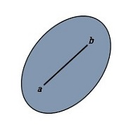

### 凸集(convex set)

凸集(convex set)，实数R上（或复数C上）的**向量空间**中，如果集合S中任两点的连线上的点都在S内，则称集合S为凸集[1]。

**线性规划问题的可行解域一定是凸集**

### 参考

[1] 百度百科, http://baike.baidu.com/link?url=Ju0yj7jStGGAZ2atLK61R4AOBja5DjhemT53aP-QJk2OXELuEJ1qwbHxeUvjLgj3S-EgeAd2azh-yi9yhzd2Ve1fmWCtkjFvifkxllNMyCi