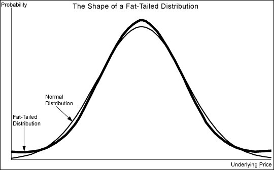
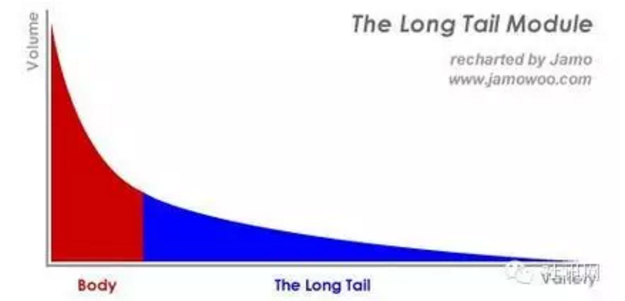

### Heavy-tailed distributions

若一随机变量的密度函数以指数函数的速度衰减至零，就称此变量的分布是“薄尾”(light tail)型的

若密度函数以幂函数的速度衰减至零，就称此变量的分布是“肥尾”(fat tail)型的[1]。

### Pareto distribution

帕累托分布是以意大利经济学家维弗雷多·帕雷托命名的。 是从大量真实世界的现象中发现的幂定律分布。这个分布在经济学以外，也被称为布拉德福分布[2]。

详见维基百科。

### 长尾理论[3]

一个小数乘以一个非常大的数字等于一个大数，如果你的基数足够大，那么给你一件再不畅销的东西，你的销售量都足够大。涓涓细流，汇聚成河。所谓长尾效应就在于它的数量上，将所有非流行的市场累加起来就会形成一个比流行市场还大的市场。

长尾（The Long Tail）这一概念是由《连线》杂志主编Chris Anderson在2004年十月的“长尾” 一文中最早提出，用来描述诸如亚马逊和Netflix之类网站的商业和经济模式。

“长尾”实际上是统计学中幂律（Power Laws）和帕累托分布（Pareto distributions）特征的一个口语化表达。

过去人们只能关注重要的人或重要的事，如果用正态分布曲线来描绘这些人或事，人们只能关注曲线的“头部”，而将处于曲线“尾部”、需要更多的精力和成本才能关注到的大多数人或事忽略。例如，在销售产品时，厂商关注的是少数几个所谓“VIP”客户，“无暇”顾及在人数上居于大多数的普通消费者。

在网络时代，由于关注的成本降低，人们有可能以很低的成本关注正态分布曲线的“尾部”，关注“尾部”产生的总体效益甚至会超过“头部”。例如，某著名网站是世界上最大的网络广告商，它没有一个大客户，收入完全来自被其他广告商忽略的中小企业。安德森认为，网络时代是关注“长尾”、发挥“长尾”效益的时代。

只要存储和流通的渠道足够大，需求不旺或销量不佳的产品共同占据的市场份额就可以和那些数量不多的热卖品所占据的市场份额相匹敌甚至更大。

**长尾概念内涵**

简单的说，所谓长尾理论是指，只要产品的存储和流通的渠道足够大，需求不旺或销量不佳的产品所共同占据的市场份额可以和那些少数热销产品所占据的市场份额相匹敌甚至更大，即众多小市场汇聚成可产生与主流相匹敌的市场能量。也就是说，企业的销售量不在于传统需求曲线上那个代表“畅销商品”的头部，而是那条代表“冷门商品”经常为人遗忘的长尾。

举例来说，一家大型书店通常可摆放10万本书，但亚马逊网络书店的图书销售额中，有四分之一来自排名10万以后的书籍。这些“冷门”书籍的销售比例正以高速成长，预估未来可占整个书市的一半。这意味着消费者在面对无限的选择时，真正想要的东西、和想要取得的渠道都出现了重大的变化，一套崭新的商业模式也跟着崛起。简而言之，长尾所涉及的冷门产品涵盖了几乎更多人的需求，当有了需求后，会有更多的人意识到这种需求，从而使冷门不再冷门。

**长尾的案例**

Google adwords、Amazon、Itune都是长尾理论的优秀案例。

1、 Google是一个最典型的“长尾”公司，其成长历程就是把广告商和出版商的“长尾”商业化的过程。以占据了Google半壁江山的AdSense为例，它面向的客户是数以百万计的中小型网站和个人—对于普通的媒体和广告商而言，这个群体的价值微小得简直不值一提，但是Google通过为其提供个性化定制的广告服务，将这些数量众多的群体汇集起来，形成了非常可观的经济利润。据报道，Google的市值已超过2100亿美元，被认为是“最有价值的媒体公司”，远远超过了那些传统的老牌传媒。

2、长尾理论与图书出版。图书出版业是“小众产品”行业，市场上流通的图书达300万种。大多数图书很难找到自己的目标读者，只有极少数的图书最终成为畅销书。由于长尾书的印数及销量少，而出版、印刷、销售及库存成本又较高，因此，长期以来出版商和书店的经营模式多以畅销书为中心。网络书店和数字出版社的发展为长尾书销售提供了无限的空间市场。在这个市场里，长尾书的库存和销售成本几乎为零，于是，长尾图书开始有价值了。销售成千上万的小众图书，哪怕一次仅卖一两本，其利润累计起来可以相当甚至超过那些动辄销售几百万册的畅销书。如亚马逊副经理史蒂夫·凯塞尔所说：“如果我有10万种书，哪怕一次仅卖掉一本，10年后加起来它们的销售就会超过最新出版的《哈利·波特》。”

**长尾理论与二八理论殊途同归**

在资源稀缺假设前提下，传统经济属于典型的供给方规模经济， 体现的是帕累托分布的需求曲线头部，用户的购买行为并不完全反映需求，主流产品的销售量大不等同于对它的需求也大， 只是主流产品占据了大部分市场，限制了人们的选择权。 随着整个社会经济以及科技的发展，今天我们已步入一个“富足经济”时代，人们的生活质量在不断提高。

一方面，商品在无限地细分，用户的取向除了具备一些共性之外，越来越追求个性化的需求，所以对各种商品都有存在需求的可能；而另一方面，随着技术进步和互联网的兴起，电子商务在聚集了这类产品原本分散的用户的同时，也降低了交易成本。

长尾理论阐述的实际是丰饶经济学。 企业采取差异化战略，“小块需求”通过“小块渠道”对“小块供应”的小额交易，建立全新的低成本渠道的销售模式满足人们更加个性化和具体化需求， 当无数用户的个性化需求予以满足时，必然导致长尾的产生， 形成了独特的需求方规模经济，完美展示了帕累托分布的需求曲线尾部。当大规模的市场形态向着许多细小的市场聚合形态转变，两种形态趋于并存时，**“二八原理”和“长尾理论”现象会同时出现在一条需求曲线的前后两个不同部分，二者相辅相成和相互补充**。

因此，长尾理论可以说是互联网出现后企业商业运营环境变化的直接结果，长尾理论只是在特定条件下从某一个角度来看问题，没有也不可能否定“二八原理”，长尾理论应当还是二八原理，是对过去强调的“二八原理”在一种新的环境下一个很好的补充和完善，二者殊途同归。

### 参考

[1] 杰迪武士, http://lijiwei19850620.blog.163.com/blog/static/978415382014712102257983/?ignoreua

[2] 维基百科, https://zh.wikipedia.org/wiki/%E5%B8%95%E7%B4%AF%E6%89%98%E5%88%86%E5%B8%83

[3] 社讯网, https://sanwen8.cn/p/113jyHf.html